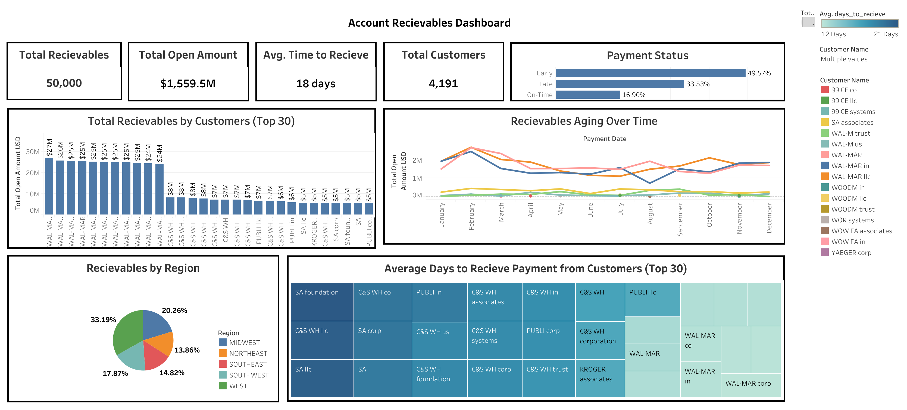
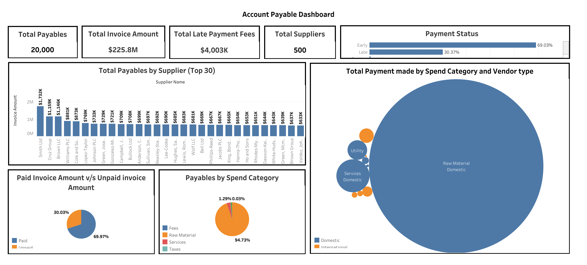

# Working Capital Management (2025) Tableau Visualization Project 💼
📅 Date: Aug 2025  
👤 Author: Nishanth Manoharan  
🛠️ Tech Stack: Tableau, AWS RDS (SQL Server), SQL, Python, Data Visualization  

---

📌 **Overview**  
This project is a 📊 **dynamic Tableau dashboard solution** designed to analyze **Accounts Receivable (AR)** and **Accounts Payable (AP)** data for large-scale enterprises.  
By connecting Tableau to **AWS RDS (SQL Server)** and applying **DSO/DPO financial metrics**, the dashboards highlight inefficiencies, bottlenecks, and payment behaviors across customers and suppliers — providing actionable insights for finance teams.  

---

🚀 **Workflow & Architecture**  
1. **Data Source & Integration (AWS RDS – SQL Server)** 🗄️  
   - Financial transaction data (customers, suppliers, receivables, payables) is stored in an **AWS RDS SQL Server** instance.  
   - SQL queries extract key AR/AP metrics and prepare the dataset for visualization.  

2. **Data Transformation & Metrics** ⚙️  
   - Key calculated fields:  
     - **DSO (Days Sales Outstanding)** = Efficiency of customer collections  
     - **DPO (Days Payable Outstanding)** = Supplier payment cycle analysis  
     - **Aging Buckets**: 0–30, 31–60, 61–90, 90+ days  

3. **Tableau Dashboards – AR & AP** 📊  
   - **Accounts Receivable Dashboard**: Highlights overdue invoices, customer payment patterns, and exposure vs. credit limits.  
   - **Accounts Payable Dashboard**: Tracks supplier payment timelines, helps identify leverage opportunities in negotiations.  

4. **Business Insights & Value** 💡  
   - Improved **cash flow visibility** across $1.56B receivables and $226M payables.  
   - Tracked **4K+ customers** and **500 suppliers**.  
   - Reduced risks by identifying overdue accounts and inefficient payment cycles.  

---

📸 **Tableau Dashboards**  
### Accounts Receivable Dashboard  
  

### Accounts Payable Dashboard  
  

---

🎯 **Key Features**  
✅ **End-to-End Financial Analysis** – AR & AP metrics, DSO/DPO, aging buckets.  
✅ **Real-Time Data Source** – Integrated with AWS RDS SQL Server.  
✅ **Interactive Tableau Dashboards** – Drilldowns, filters, and KPIs.  
✅ **Actionable Insights** – Improved credit risk monitoring and supplier management.  

---
